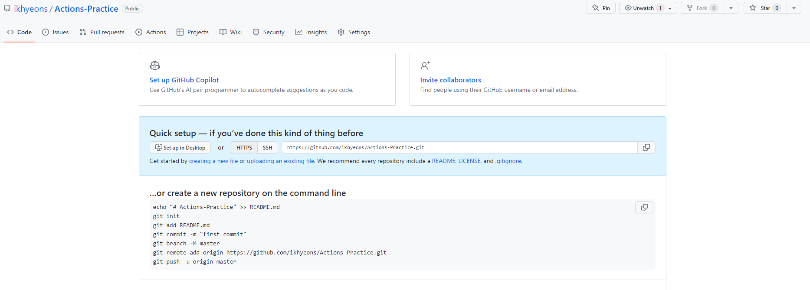

# CI/CD Git Actions 배포 자동화 설정

## CI/CD란 무엇인가?

Continuous Integration / Continuous Delivery(Deploy)의 약자이다.

CI는 형상관리 툴(git)을 이용하여 지속적으로 작성한 소스들을 통합하는 행위이다.

CD는 소스를 수동적으로 테스트하고, 빌드하여 배포까지 하는 행위이다.

이러한 과정은 시간과 노력을 필요로 하는데, 이를 자동화 시키는 툴 중 하나가

Git Actions이다.

## Git Actions는 어떻게 동작하는가?

runner는 단순히 하나의 컴퓨터이다. 해당 컴퓨터에 작업명령을 yml파일로 지시할 수 있는데,

깃 허브에 커밋이나 풀 리퀘스트, 머지와 같은 이벤트들이 트리거 되면, runner를 작동시켜 특정한 작업을 수행시키게 된다.

이 때 runner는 깃허브에서 제공하는 runner가 있지만, 연구실 파일을 관리하기 위해서 로컬 컴퓨터(연구실 서버컴)에 직접 runner를 설치하여 사용할 것이다.

내가 연구실 졸업하면 누군가 또 배워서 해야하니 정리해서 알려줄 때 숙지하고 계속 물려주도록 하자.

## 어떻게 구현하는가?

아래는 runner를 직접 로컬 컴퓨터에 설치하여 구동시키는 작업을 할 것이다.
순서대로 따라하면 어떤식으로 돌아가는지 단번에 알 수 있을 정도로 쉬운 내용이니
한번 따라 해 보고 나중에 개인 프로젝트를 만들 때 꼭 써먹자!

우리 연구실 서버팀은 소스트리를 사용하는 걸로 통일된 것 같으니 소스트리로 설명함.

파일을 생성하자. 생성할 파일은 다음과 같다.

- 깃 허브에 올라갈 파일 ← 개인 프로젝트에서 작성한 소스가 여기 들어갈 것이다. 실전에서는 소스를 커밋하는 로컬 컴퓨터(너의 노트북)에 있을 것이다.

아래 두 폴더는 실전에서는 배포하는 컴퓨터(연구실 서버컴)에 있을 것이다.

- runner가 저장될 폴더 ← 러너를 다운받을 곳이다.
- 서버파일 ← 개인 프로젝트 소스 파일을 배포할 서버폴더이다.

폴더를 생성하면 안에는 다 비워져 있을 것이다.


그다음 소스파일을 깃허브와 연동한다. Git/GitHub를 떼고 왔다는 가정하에 연동과정은 생략하겠음.

나는 Actions-Practice라는 이름으로 repo를 만들고 연동하였다.


이제 해당 repo에 runner를 사용하기 위한 yml을 연결할 것이다.
깃헙 repo의 카테고리 중 Actions 태그로 가서 set up a workflow yourself→ 를 누른다.


이러면 아래와 같은 창이 나타나는데,

여기서 runner가 어떻게 행동할 지를 작성할 수 있다.

일단 매우 간단한 예제를 가져왔는데 이걸로 하자.
yml은 들여쓰기에 매우 취약하니 들여쓰기 잘하자.

```
name: CI/CD

on: push

jobs:
    build:
        runs-on: self-hosted

        steps:
          - uses: actions/checkout@v3
```

간략한 설명을 덧붙이자면

```
name: CI/CD // 실행할 action의 이름

on: push // 어떤 이벤트가 트리거 되었을 때 실행할 것인지

jobs: // 수행할 작업들을 작성함
    build: // 수행할 작업의 대분류 이름
        runs-on: self-hosted // 어떤 환경에서 돌릴 것인지
//self-hosted 는 로컬에 설치한 runner에서 돌린다는 뜻이다.

        steps: //진행할 단계
            - uses: actions/checkout@v3

// uses : 남이 만들어놓은 실행 작업
// actions/checkout은 우리 깃허브에 있는 소스를 다운하는 작업임.
//이 외에도 uses: actions/setup-node@v1 처럼 노드를 다운하는 작업도 있음
//이건 익숙해지면 찾아보셈
```

그다음 해당 파일을 저장하면 내 GitHub repo에 아래와 같은 폴더/파일이 생성된다.


해당 파일 변동사항을 소스트리에서 패치, 풀 받자.
소스폴더를 VSCode에서 열어보면 파일트리는 다음과 같을 것이다.


이제 index.html 파일을 루트에 생성한 후 커밋하자.


이러면 Github의 Actions 탭에 워크플로우가 생성된 것을 확인할 수 있는데, 지금은 필요 없으니 오른쪽 점3개에서 cancel run을 때려 다 꺼주자.

이제 로컬 컴퓨터에 액션을 실행할 runner를 다운받을 것이다.

repo의 카테고리 중 setting → Actions탭 → Runner에 가서
New self-hosted runner 초록색 버튼을 클릭한다.

그러면 아래와 같은 창이 뜨는데,


windows power shell을 켜서
우리가 만든 러너있는곳 폴더까지 cd로 이동한다.
cd '러너있는곳절대경로'

그다음 페이지에 있는 맨 위에 명령어
mkdir actions-runner; cd actions-runner는 무시하고
그 아래부터 쭉 붙여넣기, Enter 한다.

./config.cmd 에서는 러너 이름을 입력하세요 무슨무슨 말이 뜨는데
일단 default로 엔터만 치자.

명령어를 해석하자면 순서대로

- runner를 설치하는 zip파일을 다운로드
- 파일해쉬 설정
- zip파일 압축해제
- 환경설정
- runner 동작

순이다.

정상적으로 ./run.cmd 까지 입력하면 아래 사진과 같이 runner가 동작하는 것을 볼 수 있다.


power shell을 끄지 않고 runner가 켜진 상태로
github페이지를 켜서 해당 해당repo에 Actions탭에 들어간 다음
index.html 소스를 약간 수정하고 커밋/푸시 해보자

그러면 워크플로우가 돌아가는 것을 확인할 수 있다.


워크플로우가 완전히 돌아가면 러너있는 곳 폴더로 가서

러너있는곳/\_work/repo이름/repo이름/

에 가보면 우리가 작성한 파일을 runner가 다운한 것을 확인할 수 있다.

이 다운받은 파일은 아까 yml에 작성한

-uses: actions/checkout@v3 명령을 runner가 실행한 결과이다.

그다음 이 파일을 express로 계속 배포한다면, CI/CD의 자동화를 구축할 수 있다!!!!

지금은 스태틱한 html파일만 배포하였는데

react같은 경우 yml에

- uses: actions/setup-node@v3 // 노드js다운
- npm run build

의 순서로 명령을 입력한다면
runner가 자동으로 build하고 build결과 나온 파일을
똑같이 express로 배포한다면 구현할 수 있을 것이다..

AWS EC2에서의 배포는 이 runner를 EC2에 설치하여 배포하는 것.
방법은 동일하다.

꼭 숙지하고 단련해서 배포의 달인이 되어보자..

작성하는데 3시간 정도 걸림.
